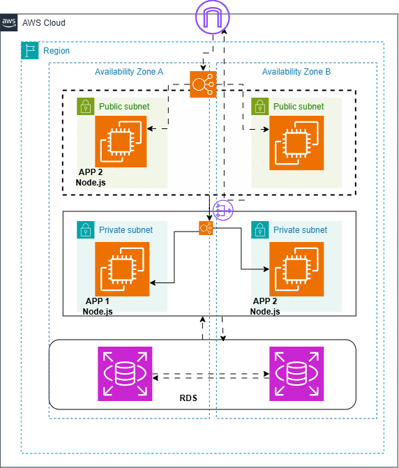

# Architecture Diagram

## AWS Three-Tier Architecture




## Network Layout

| Tier | Subnets | Internet Access | Load Balancer |
| :--- | :--- | :--- | :--- |
| **Public** | Public | Inbound/Outbound | Public ALB |
| **Web** | Private | Outbound via NAT | Internal ALB |
| **Application** | Private | Outbound via NAT | None |
| **Database** | Isolated | No Internet access | None |

## Traffic Flow

```text
Internet
   ↓
Public ALB
   ↓
Nginx Web Tier :80
   ↓
Internal ALB :3000
   ↓
Node.js App Tier :3000
   ↓
RDS PostgreSQL :5432
```


The architecture spans two Availability Zones to provide resilience against an AZ-level failure.

For security-group rules and permitted ports, see [`SECURITY-DESIGN.md`](https://chatgpt.com/c/SECURITY-DESIGN.md).

For the Infrastructure as Code implementation, see [`terraform/`](https://chatgpt.com/c/terraform/).